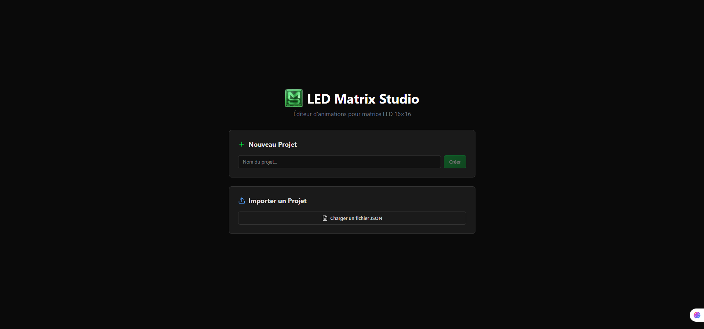

# LED Matrix Studio

**Éditeur d'animations pour matrice LED 16×16** — Application desktop (Tauri) et web (Vite).


---

##  Fonctionnalités

- Dessin pixel par pixel sur grille 16×16
- Timeline avec gestion des frames (ajout, duplication, suppression, réorganisation)
- Formes prédéfinies (cercle, carré, cœur, flèches, etc.) utilisables comme pinceau
- Transformations : rotation, miroir, décalage cyclique
- Simulation de clignotement LED
- Export binaire pour 4 EEPROMs (quadrants TL, TR, BL, BR)
- Sauvegarde/chargement de projets JSON
- Raccourcis clavier (Ctrl+Z/Y pour Undo/Redo, Ctrl+S pour sauvegarder)

---

##  Installation & Lancement

### Prérequis

- **Node.js** ≥ 18
- **Rust** (pour Tauri) — installer via [rustup.rs](https://rustup.rs/)
- **Tauri CLI** : `npm install -g @tauri-apps/cli` (ou utiliser via npx)

### Installation des dépendances

```bash
npm install
```

### Mode développement

**Version Web uniquement :**
```bash
npm run dev
```
Ouvre http://localhost:5173

**Version Desktop (Tauri) :**
```bash
npm run tauri:dev
```
Lance le serveur Vite + ouvre la fenêtre native Tauri.

---

##  Générer un exécutable / installateur

### Build Web (pour déploiement sur serveur)

```bash
npm run build
```
Les fichiers statiques sont générés dans le dossier `dist/`.

### Build Desktop (Tauri)

```bash
npm run tauri:build
```

**Où trouver l'exécutable / installateur :**

| Plateforme | Chemin |
|------------|--------|
| Windows (.exe, .msi) | `src-tauri/target/release/bundle/msi/` et `src-tauri/target/release/bundle/nsis/` |
| macOS (.app, .dmg) | `src-tauri/target/release/bundle/macos/` et `src-tauri/target/release/bundle/dmg/` |
| Linux (.deb, .AppImage) | `src-tauri/target/release/bundle/deb/` et `src-tauri/target/release/bundle/appimage/` |

L'exécutable standalone se trouve dans `src-tauri/target/release/led-matrix-studio.exe` (Windows).

---

## Icônes

Les icônes de l'application sont dans `src-tauri/icons/` :
- `icon.png` — icône principale (PNG)
- `icon.ico` — icône Windows

Pour regénérer les icônes depuis le logo (nécessite ImageMagick) :

```powershell
# Windows PowerShell
magick convert src/assets/logo.png -resize 256x256 src-tauri/icons/icon.png
magick convert src/assets/logo.png -resize 256x256 src-tauri/icons/icon-256.png
magick convert src/assets/logo.png -resize 32x32 src-tauri/icons/icon-32.png
magick convert src-tauri/icons/icon-256.png src-tauri/icons/icon-32.png src-tauri/icons/icon.ico
```

---

##  Structure du projet

```
led-matrix-studio/
├── src/                    # Code React + TypeScript
│   ├── assets/             # Logo, schémas
│   ├── components/         # Composants UI
│   ├── core/               # Logique métier (export binaire, types)
│   └── store/              # État global (Zustand)
├── src-tauri/              # Backend Tauri (Rust)
│   ├── icons/              # Icônes de l'application
│   ├── src/main.rs         # Point d'entrée Rust
│   ├── Cargo.toml          # Dépendances Rust
│   └── tauri.conf.json     # Configuration Tauri
├── dist/                   # Build web (généré)
└── package.json            # Scripts npm
```

---

##  Scripts npm disponibles

| Commande | Description |
|----------|-------------|
| `npm run dev` | Serveur de développement Vite (web) |
| `npm run build` | Build de production (web) |
| `npm run preview` | Prévisualiser le build web |
| `npm run tauri:dev` | Lancer l'app desktop en mode dev |
| `npm run tauri:build` | Générer l'installateur/exécutable desktop |



---

## Schéma matériel

Le projet est conçu pour piloter une matrice LED 16×16 via 4 EEPROMs (un par quadrant 8×8).


---

##  Licence

MIT — Tiger-Foxx © 2025
