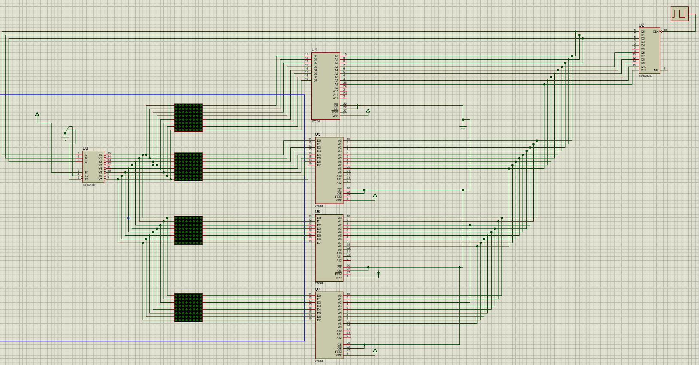

# React + TypeScript + Vite

This template provides a minimal setup to get React working in Vite with HMR and some ESLint rules.

Currently, two official plugins are available:

- [@vitejs/plugin-react](https://github.com/vitejs/vite-plugin-react/blob/main/packages/plugin-react) uses [Babel](https://babeljs.io/) (or [oxc](https://oxc.rs) when used in [rolldown-vite](https://vite.dev/guide/rolldown)) for Fast Refresh
- [@vitejs/plugin-react-swc](https://github.com/vitejs/vite-plugin-react/blob/main/packages/plugin-react-swc) uses [SWC](https://swc.rs/) for Fast Refresh

## React Compiler

The React Compiler is not enabled on this template because of its impact on dev & build performances. To add it, see [this documentation](https://react.dev/learn/react-compiler/installation).

## Expanding the ESLint configuration

If you are developing a production application, we recommend updating the configuration to enable type-aware lint rules:

```js
export default defineConfig([
  globalIgnores(['dist']),
  {
    # LED Matrix Studio — Tauri build notes

    This repository is a React + TypeScript + Vite application that can be built as a desktop app using Tauri.

    Quick start (dev):

    1. Install Node.js (>=18), Rust toolchain and Tauri prerequisites:

    ```pwsh
    # Windows (PowerShell)
    choco install rust -y     # or via https://rustup.rs/
    npm install -g @tauri-apps/cli
    ```

    2. Install dependencies and run in dev mode:

    ```pwsh
    npm install
    npm run dev        # opens Vite dev server
    # In another terminal: npm run tauri:dev
    ```

    Build for production:

    ```pwsh
    npm run build
    npm run tauri:build
    ```

    Notes:
    - The project expects an icon at `src-tauri/icons/icon.png` (copied from `src/assets/logo.png`). For proper platform icons you may provide `icon.ico` (Windows) and `icon.icns` (macOS) inside `src-tauri/icons`.
    - Tauri requires the Rust toolchain installed and cargo available on PATH.

    If you want, I can generate basic icon files from the logo, but for production you should create proper `.ico` and `.icns` assets.

    ---

    **Guide complet du projet**

    Description
    - LED Matrix Studio : éditeur d'animations pour matrice LED 16×16. Permet de dessiner, gérer une timeline, appliquer formes, et exporter des binaires pour EEPROM (4 quadrants : TL, TR, BL, BR).

    Fichiers importants
    - `src/` : code React + TS
    - `src/assets/logo.png` : logo de l'application (utilisé comme icône)
    - `src/assets/MONTAGE.png` : capture du schéma matériel (inclus ci-dessous)
    - `src-tauri/tauri.conf.json` : configuration Tauri

    Capture d'écran du schéma (dossier `src/assets`):

    

    Génération d'icônes (conseils)
    - Pour Windows (ICO) avec ImageMagick :

    ```pwsh
    # Installez ImageMagick (https://imagemagick.org)
    magick convert src/assets/logo.png -resize 256x256 src-tauri/icons/icon-256.png
    magick convert src/assets/logo.png -resize 48x48 src-tauri/icons/icon-48.png
    magick convert src/assets/logo.png -resize 32x32 src-tauri/icons/icon-32.png
    # Puis créez l'ICO (Windows) :
    magick convert src-tauri/icons/icon-256.png src-tauri/icons/icon-48.png src-tauri/icons/icon-32.png src-tauri/icons/icon.ico
    ```

    - Pour macOS (ICNS) :

    ```bash
    # Créez un dossier .iconset avec les tailles requises
    mkdir -p tmp.iconset
    magick convert src/assets/logo.png -resize 16x16 tmp.iconset/icon_16x16.png
    magick convert src/assets/logo.png -resize 32x32 tmp.iconset/icon_16x16@2x.png
    magick convert src/assets/logo.png -resize 32x32 tmp.iconset/icon_32x32.png
    magick convert src/assets/logo.png -resize 64x64 tmp.iconset/icon_32x32@2x.png
    magick convert src/assets/logo.png -resize 128x128 tmp.iconset/icon_128x128.png
    magick convert src/assets/logo.png -resize 256x256 tmp.iconset/icon_128x128@2x.png
    magick convert src/assets/logo.png -resize 256x256 tmp.iconset/icon_256x256.png
    magick convert src/assets/logo.png -resize 512x512 tmp.iconset/icon_256x256@2x.png
    iconutil -c icns tmp.iconset -o src-tauri/icons/icon.icns
    rm -r tmp.iconset
    ```

    Packaging & build
    - Build web :

    ```pwsh
    npm install
    npm run build
    ```

    - Build Tauri :

    ```pwsh
    # Assurez-vous d'avoir Rust, cargo et tauri-cli installés
    npm run tauri:build
    ```

    Debug & dev
    - Dev web (vite) : `npm run dev`
    - Dev desktop (Tauri) : `npm run tauri:dev` (ouvre la fenêtre native pointant sur le dev server)

    Support & notes
    - Le dossier `src-tauri/icons` contient `icon.png` (copie du logo). Pour des releases propres, générez `icon.ico` et `icon.icns` comme indiqué ci‑dessus.

    Besoin d'aide ? Dites-moi si vous voulez que je :
    - génère automatiquement des PNG à plusieurs tailles ici (nécessite ImageMagick local),
    - prépare un script pour automatiser la création des icônes,
    - ou que je rédige des instructions plus détaillées pour la CI (GitHub Actions) afin d'automatiser les builds Tauri.
    files: ['**/*.{ts,tsx}'],
